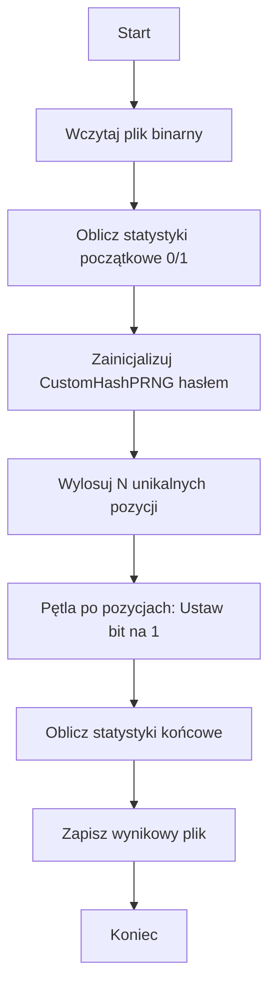
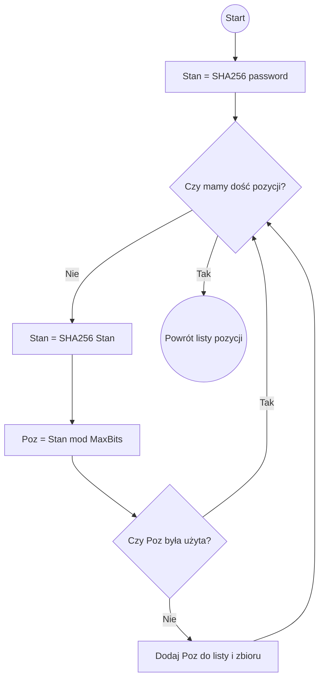

# Dokumentacja Algorytmu Wstrzykiwania Bitów (Hash-PRNG Steganography)

Ten dokument opisuje działanie skryptu `skrypt.py`, który służy do modyfikacji rozkładu bitów w plikach binarnych (np. TRNG) poprzez wstrzykiwanie określonej liczby "jedynek" w pseudolosowe miejsca.

## 1. Opis Działania Algorytmu

Głównym celem algorytmu jest zmiana statystyki pliku binarnego (zwiększenie liczby bitów o wartości 1) w sposób deterministyczny (zależny od hasła), ale wyglądający na losowy.

### Główne komponenty:
1.  **CustomHashPRNG**: Autorski generator liczb pseudolosowych oparty na kryptograficznej funkcji skrótu SHA-256.
2.  **Bit Injector**: Mechanizm mapujący wylosowane liczby na konkretne pozycje bitowe w pliku i wykonujący operację logiczną `OR`.

---

## 2. Matematyka i Logika PRNG

### Mechanizm łańcucha skrótów (Hash Chaining)
Generator wykorzystuje własność **efektu lawinowego** funkcji SHA-256. Nawet najmniejsza zmiana wejścia powoduje drastyczną zmianę wyjścia.

1.  **Inicjalizacja (Seed):**
    Stan początkowy $S_0$ jest obliczany jako skrót SHA-256 z hasła użytkownika:
    $$S_0 = \text{SHA-256}(\text{hasło})$$

2.  **Iteracja stanu:**
    Każdy kolejny stan generatora jest wynikiem haszowania stanu poprzedniego:
    $$S_{i+1} = \text{SHA-256}(S_i)$$

3.  **Mapowanie na pozycję:**
    32-bajtowy (256-bitowy) stan $S_{i+1}$ jest traktowany jako duża liczba całkowita $V_i$. Pozycja bitu $P_i$ w pliku o rozmiarze $N$ bitów obliczana jest za pomocą operacji modulo:
    $$P_i = V_i \pmod{N}$$

### Unikalność pozycji
Algorytm gwarantuje unikalność wylosowanych pozycji poprzez sprawdzanie ich w zbiorze `used_positions`. Jeśli $P_i$ już wystąpiło, generator wykonuje kolejny krok łańcucha bez dodawania pozycji do listy wynikowej.

---

## 3. Schematy blokowe (Flowcharts)

### Ogólny proces wstrzykiwania danych



### Działanie generatora CustomHashPRNG



---

## 4. Sposób korzystania

### Konfiguracja w kodzie
W sekcji `if __name__ == "__main__":` znajdują się kluczowe zmienne:

*   `TAJNE_HASLO`: Klucz determinujący, które bity zostaną wybrane. Zmiana hasła całkowicie zmienia zestaw wylosowanych pozycji.
*   `PLIK_TRNG`: Nazwa pliku wejściowego (np. `TRNG_P.bit`).
*   `ILOSC_JEDYNEK_DO_UKRYCIA`: Liczba bitów, które chcemy ustawić na `1`.

### Uruchomienie
Wymagane jest środowisko Python 3. Skrypt nie wymaga zewnętrznych bibliotek (korzysta tylko z wbudowanych `os` i `hashlib`).

```bash
python skrypt.py
```

### Interpretacja wyników
Po zakończeniu działania skrypt wyświetla:
1.  Procentowy udział zer i jedynek przed modyfikacją.
2.  Procentowy udział po modyfikacji.
3.  **Liczbę faktycznie zmienionych bitów**: Jeśli algorytm wylosował pozycję, w której już była jedynka, stan bitu nie ulega zmianie, a licznik "faktycznie zmienionych" będzie mniejszy niż `ILOSC_JEDYNEK_DO_UKRYCIA`.

---

## 5. Zastosowanie w testach NIST
Narzędzie to służy do celowego wprowadzania "biasu" (odchylenia) do danych losowych. Dzięki temu można testować czułość pakietu statystycznego NIST (np. Test Monobit) na dane o różnym stopniu zanieczyszczenia niepożądanymi wzorcami lub nadmiarem jedynek.
