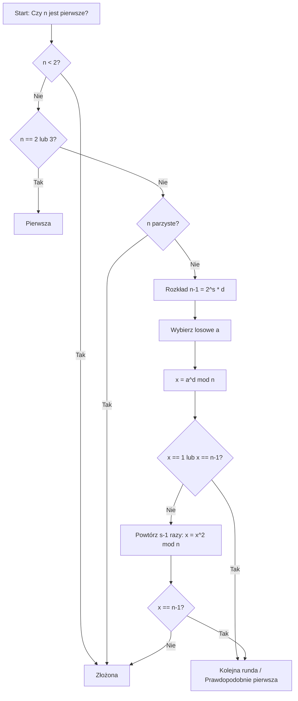

# Poszukiwanie Liczb Pierwszych w Danych Binarnych

Projekt ten zajmuje się identyfikacją liczb pierwszych w dużym zbiorze danych binarnych (pochodzących np. z generatora liczb losowych TRNG) przy użyciu probabilistycznego testu pierwszości Millera-Rabina.

## 1. Opis algorytmu Millera-Rabina

Algorytm Millera-Rabina to probabilistyczny test pierwszości, który pozwala szybko stwierdzić, czy dana liczba jest złożona, lub czy jest "prawdopodobnie pierwsza". Jest on znacznie wydajniejszy od testów deterministycznych dla bardzo dużych liczb (np. 2048-bitowych).

**Główne kroki algorytmu:**
1.  **Rozkład:** Przedstawiamy $n-1$ w postaci $2^s \cdot d$, gdzie $d$ jest nieparzyste.
2.  **Losowanie:** Wybieramy losową podstawę $a$ z zakresu $[2, n-2]$.
3.  **Test potęgowania:** Obliczamy $x = a^d \pmod{n}$. Jeśli $x = 1$ lub $x = n-1$, liczba przechodzi test.
4.  **Pętla kwadratowa:** Podnosimy $x$ do kwadratu modulo $n$ maksymalnie $s-1$ razy. Jeśli w którymś kroku otrzymamy $n-1$, liczba przechodzi test.
5.  **Wynik:** Jeśli liczba przejdzie $k$ niezależnych rund testu, uznajemy ją za prawdopodobnie pierwszą z bardzo wysokim prawdopodobieństwem ($1 - 4^{-k}$).

### Schemat działania algorytmu

## 2. Opis implementacji

Implementacja znajdująca się w pliku `main.py` została zoptymalizowana pod kątem wydajności przy użyciu następujących technik:

*   **Biblioteka `gmpy2`:** Wykorzystano bibliotekę `gmpy2` (wrapper na biblioteki C: GMP, MPFR, MPC), która oferuje ekstremalnie szybkie operacje arytmetyczne na liczbach o dowolnej precyzji, w tym natywną funkcję `powmod`.
*   **Wstępne odsiewanie (Trial Division):** Przed uruchomieniem kosztownego testu Millera-Rabina, każda liczba jest sprawdzana pod kątem podzielności przez małe liczby pierwsze (do 199). Pozwala to na natychmiastowe odrzucenie ogromnej większości liczb złożonych.
*   **Przetwarzanie równoległe (`multiprocessing`):** Program automatycznie wykrywa liczbę rdzeni procesora i rozdziela obliczenia na wiele procesów równoległych przy użyciu `Pool.imap_unordered`.
*   **Efektywne zarządzanie pamięcią:** Plik wejściowy `TRNG_P.bit` jest czytany w "chunkach" po 256 bajtów, co odpowiada poszukiwaniu liczb 2048-bitowych.

## 3. Wnioski z eksperymentu

Przeprowadzono test na pliku binarnym o rozmiarze **128 MB**.

| Parametr | Wartość |
| :--- | :--- |
| **Plik wejściowy** | `TRNG_P.bit` (128 MB) |
| **Rozmiar sprawdzanych liczb** | 256 bajtów (2048 bitów) |
| **Liczba rdzeni CPU** | 16 |
| **Czas wykonania** | ~18.48 s |
| **Liczba znalezionych liczb pierwszych** | **378** |

**Kluczowe obserwacje:**
*   **Skalowalność:** Zastosowanie `multiprocessing` pozwoliło na niemal liniowe przyspieszenie obliczeń na wielordzeniowych procesorach.
*   **Wydajność `gmpy2`:** Użycie dedykowanej biblioteki do arytmetyki dużych liczb pozwoliło na osiągnięcie czasu poniżej 20 sekund dla ponad pół miliona 2048-bitowych kandydatów.
*   **Gęstość liczb pierwszych:** W badanym zbiorze 128 MB danych (ok. 524 tys. bloków) znaleziono 378 liczb pierwszych, co jest wynikiem zgodnym z oczekiwaniami statystycznymi dla liczb tej wielkości (twierdzenie o liczbach pierwszych).
